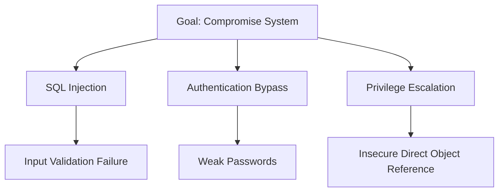

# Security Pro Pack

Comprehensive security plugin pack including security auditing, penetration testing, compliance checking, cryptography auditing, and threat modeling.

## When to Use

Use this skill when:
- Conducting comprehensive security audits
- Performing penetration testing
- Checking compliance standards (PCI-DSS, HIPAA, SOC2)
- Auditing cryptography implementations
- Creating threat models for applications
- Reviewing security architecture
- Implementing security best practices

## Key Components

### Security Auditing
- Code review for security vulnerabilities
- Dependency vulnerability scanning
- Configuration review
- Secrets detection
- Access control verification

### Penetration Testing
- Automated vulnerability scanning
- Manual exploitation testing
- Privilege escalation attempts
- Business logic testing
- Social engineering simulation

### Compliance Checking
- PCI-DSS requirements
- HIPAA security rules
- SOC2 controls
- GDPR compliance
- ISO 27001 standards

### Cryptography Auditing
- Encryption algorithm review
- Key management assessment
- TLS/SSL configuration
- Hash function validation
- Random number generation

### Threat Modeling
- STRIDE methodology
- Attack tree analysis
- Risk assessment
- Mitigation strategies
- Security requirements

## Security Frameworks

### OWASP ASVS (Application Security Verification Standard)
- Level 1: Basic security controls
- Level 2: Standard security controls
- Level 3: Advanced security controls

### CIS Benchmarks
- Security configuration guidelines
- Best practices for cloud providers
- OS and application hardening

### NIST Cybersecurity Framework
- Identify, Protect, Detect, Respond, Recover
- Security controls assessment

## Tools and Techniques

### Static Analysis (SAST)
- **Semgrep**: Custom security rules
- **SonarQube**: Code quality and security
- **Checkmarx**: Enterprise security scanning
- **Fortify**: Application security testing

### Dynamic Analysis (DAST)
- **OWASP ZAP**: Web application scanner
- **Burp Suite**: Professional penetration testing
- **Nessus**: Vulnerability scanner
- **Qualys**: Continuous monitoring

### Dependency Scanning
- **Snyk**: Vulnerability database
- **OWASP Dependency-Check**: CVE checking
- **Trivy**: Container and dependency scanning
- **GitHub Dependabot**: Automated updates

### Secrets Detection
- **Gitleaks**: Secret scanner
- **TruffleHog**: Git history scanning
- **GitGuardian**: Real-time secret detection

## Threat Modeling

### STRIDE Methodology
- **S**poofing: Identity impersonation
- **T**ampering: Data modification
- **R**epudiation: Action denial
- **I**nformation Disclosure: Data exposure
- **D**enial of Service: Availability attacks
- **E**levation of Privilege: Permission escalation

### Attack Tree Analysis


## Compliance Frameworks

### PCI-DSS (Payment Card Industry)
1. Install and maintain firewall configuration
2. Do not use vendor-supplied defaults
3. Protect stored cardholder data
4. Encrypt transmission of cardholder data
5. Use and regularly update anti-virus software
6. Develop and maintain secure systems
7. Restrict access to cardholder data
8. Assign unique ID to each person
9. Restrict physical access
10. Track and monitor access
11. Regularly test security systems
12. Maintain security policy

### HIPAA (Health Insurance Portability and Accountability Act)
- Administrative safeguards
- Physical safeguards
- Technical safeguards
- Breach notification requirements

## Cryptography Best Practices

### Encryption Standards
- **AES-256**: Symmetric encryption
- **RSA-2048**: Asymmetric encryption minimum
- **ECC P-256**: Efficient asymmetric encryption
- **SHA-256**: Hashing function

### Key Management
- Rotate keys regularly
- Never hard-code keys
- Use hardware security modules (HSMs)
- Implement key escrow for recovery

### TLS Configuration
```nginx
# Recommended TLS configuration
ssl_protocols TLSv1.2 TLSv1.3;
ssl_ciphers 'TLS_AES_128_GCM_SHA256:TLS_AES_256_GCM_SHA384';
ssl_prefer_server_ciphers off;
ssl_session_timeout 1d;
ssl_session_cache shared:SSL:50m;
```

## Security Testing Workflows

### Comprehensive Audit
1. **Planning**: Define scope and objectives
2. **Discovery**: Map application and infrastructure
3. **Vulnerability Scanning**: Automated tools
4. **Manual Testing**: Human verification
5. **Exploitation**: Proof of concept
6. **Reporting**: Findings and recommendations
7. **Remediation**: Fix vulnerabilities
8. **Verification**: Confirm fixes

### Threat Modeling Session
1. **Identify Assets**: Critical data and systems
2. **Create Architecture Diagram**: System components
3. **Identify Threats**: STRIDE analysis
4. **Assess Risks**: Likelihood and impact
5. **Design Mitigations**: Security controls
6. **Document**: Threat model report

## Best Practices

### Security by Design
- Implement defense in depth
- Principle of least privilege
- Fail securely (default deny)
- Secure by default configurations

### Code Review
- Review for security vulnerabilities
- Check input validation
- Verify output encoding
- Review authentication/authorization
- Audit error handling

### Incident Response
- Detection and identification
- Containment and eradication
- Recovery and restoration
- Post-incident analysis
- Lessons learned

## File Patterns

Look for:
- `**/security/**/*`
- `**/audit/**/*`
- `**/compliance/**/*`
- `**/threat-model/**/*`
- `**/pentest/**/*`

## Keywords

Security audit, penetration testing, compliance, PCI-DSS, HIPAA, SOC2, GDPR, cryptography, threat modeling, STRIDE, vulnerability scanning, secrets detection, key management, TLS configuration, security framework
